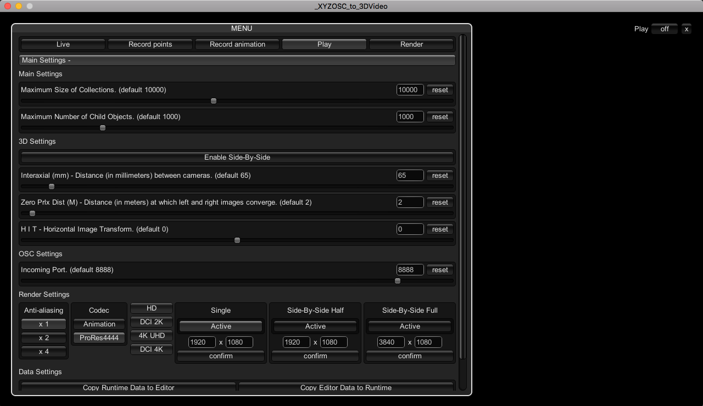
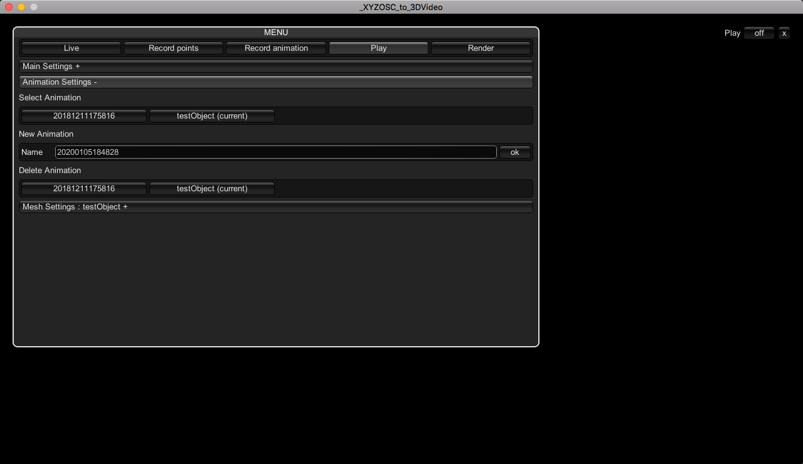
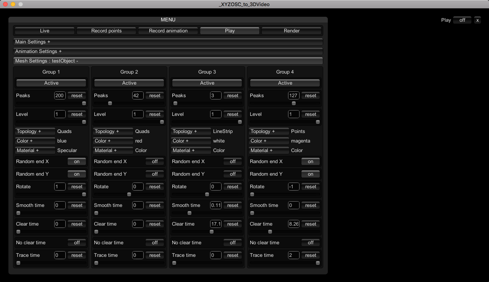

# JungAnTagen-Programming-Interaction

Commissioned by [Jung An Tagen](https://jungantagen.bandcamp.com/).

1. Max.
2. Unity.
3. Max.

These applications were used to create parts of the 3D stereoscopic film [DYAD](http://www.sixpackfilm.com/en/catalogue/show/2553).

# 1. Stereo Audio to XYZ-OSC

# 2. XYZ-OSC to 3D Video

## Main Settings

## Animation Settings

## Mesh Settings

# 3. 3D Video to Stereo Audio

